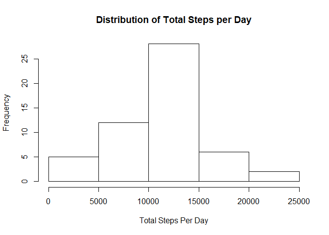
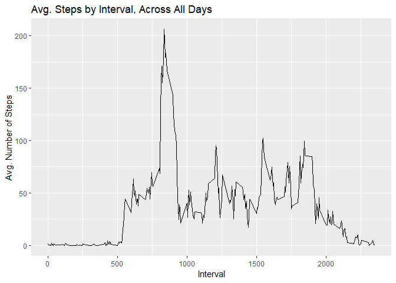
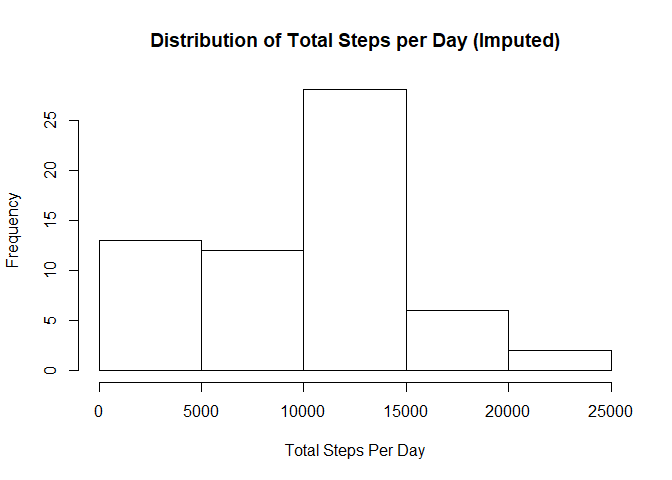
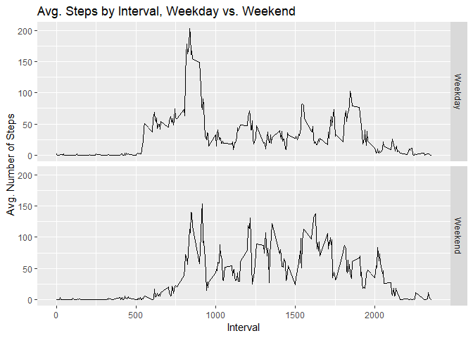

## Intro

This project makes use of data from a personal activity monitoring device. This device collects data at 5 minute intervals through out the day. The data consists of two months of data from an anonymous individual collected during the months of October and November, 2012 and include the number of steps taken in 5 minute intervals each day. (There are 288, 5-minute intervals per day.)

## Loading and preprocessing the data

```r
# Require packages 
packages <- c("stats", "graphics", "ggplot2", "grDevices", "dplyr", "Hmisc")
lapply(packages, library, character.only = TRUE)
```

```
## 
## Attaching package: 'dplyr'
```

```
## The following objects are masked from 'package:stats':
## 
##     filter, lag
```

```
## The following objects are masked from 'package:base':
## 
##     intersect, setdiff, setequal, union
```

```
## Loading required package: lattice
```

```
## Loading required package: survival
```

```
## Loading required package: Formula
```

```
## 
## Attaching package: 'Hmisc'
```

```
## The following objects are masked from 'package:dplyr':
## 
##     src, summarize
```

```
## The following objects are masked from 'package:base':
## 
##     format.pval, units
```

```
## [[1]]
## [1] "stats"     "graphics"  "grDevices" "utils"     "datasets"  "methods"  
## [7] "base"     
## 
## [[2]]
## [1] "stats"     "graphics"  "grDevices" "utils"     "datasets"  "methods"  
## [7] "base"     
## 
## [[3]]
## [1] "ggplot2"   "stats"     "graphics"  "grDevices" "utils"     "datasets" 
## [7] "methods"   "base"     
## 
## [[4]]
## [1] "ggplot2"   "stats"     "graphics"  "grDevices" "utils"     "datasets" 
## [7] "methods"   "base"     
## 
## [[5]]
## [1] "dplyr"     "ggplot2"   "stats"     "graphics"  "grDevices" "utils"    
## [7] "datasets"  "methods"   "base"     
## 
## [[6]]
##  [1] "Hmisc"     "Formula"   "survival"  "lattice"   "dplyr"    
##  [6] "ggplot2"   "stats"     "graphics"  "grDevices" "utils"    
## [11] "datasets"  "methods"   "base"
```

In this step, we read in the data. The object "data" contains all observations, whereas "extant_data" has NA values removed.


```r
data <- read.csv(unzip("./activity.zip"), header = TRUE, na.strings = "NA")

extant_data <- na.omit(read.csv(unzip("./activity.zip"), header = TRUE, na.strings = "NA"))
```

## What is mean total number of steps taken per day?


```r
# Histogram of the total number of steps taken each day.
daily_steps <- extant_data %>% group_by(date) %>% summarise(sum_steps = sum(steps))
hist(daily_steps$sum_steps, xlab = "Total Steps Per Day", main = "Distribution of Total Steps per Day")
```

<!-- -->

```r
# Mean and median number of steps taken each day.
mean_steps <- mean(daily_steps$sum_steps)
median_steps <- median(daily_steps$sum_steps)
```

## What is the average daily activity pattern?


```r
# Timeseries plot of the average number of steps taken per 5-minute interval (x-axis), averaged across all days (y-axis). 
interval_steps <- extant_data %>% group_by(interval) %>% summarise(avg_steps = mean(steps))

ggplot(data = interval_steps, aes(x = interval, y = avg_steps)) + geom_line() + 
  labs(title = "Avg. Steps by Interval, Across All Days", x = "Interval", y = "Avg. Number of Steps")
```

<!-- -->

```r
# Interval with the highest average number of steps, across all days
max_interval <- max(interval_steps$avg_steps)
```

## Imputing missing values


```r
# Total number of missing values in the dataset (i.e. the total number of rows with NAs)
na_count <- nrow(data) - nrow(extant_data)

# Locate NAs
impute_me <- which((is.na(data)), arr.ind = TRUE) # Indicies of missing values
unique(impute_me[,2]) # Proof all NAs are in "steps"
```

```
## [1] 1
```

```r
# New dataset that is equal to the original dataset but with the missing data filled in
imputed_steps <- impute(data$steps, fun = median)
filled_in <- cbind(imputed_steps, data[,2:3])

# New histogram of the total number of steps taken each day.
new_daily_steps <- filled_in %>% group_by(date) %>% summarise(new_sum_steps = sum(imputed_steps))
hist(new_daily_steps$new_sum_steps, xlab = "Total Steps Per Day", main = "Distribution of Total Steps per Day (Imputed)")
```

<!-- -->

```r
# New mean and median number of steps taken each day.
new_mean_steps <- mean(new_daily_steps$new_sum_steps)
new_median_steps <- median(new_daily_steps$new_sum_steps)
```

## Are there differences in activity patterns between weekdays and weekends?


```r
# Creates a new factor variable, "dow", in the dataset with two levels – “weekday” and “weekend".
dow <- weekdays(strptime(filled_in$date, format = "%Y-%m-%d"), abbreviate = TRUE)
new_var <- factor(dow, levels = c("Mon", "Tue", "Wed", "Thu", "Fri", "Sat", "Sun"), labels = c(rep("Weekday", 5), rep("Weekend", 2)))
filled_in_dow <- cbind(filled_in, new_var)
colnames(filled_in_dow)[4] <- "dow"

# Timeseries plot of the average number of steps taken per 5-minute interval (x-axis), averaged across all weekday or weekend days, respectively (y-axis).
dow_steps <- filled_in_dow %>% group_by(interval, dow) %>% summarise(avg_steps = mean(imputed_steps))
ggplot(data = dow_steps, aes(x = interval, y = avg_steps)) + geom_line() + facet_grid(dow ~ .) + 
  labs(title = "Avg. Steps by Interval, Weekday vs. Weekend", x = "Interval", y = "Avg. Number of Steps")
```

<!-- -->
